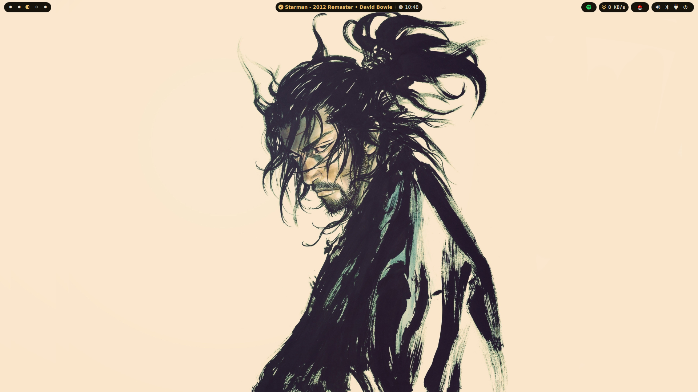

<p align="center">
  
</p>

# G_ant Shell

A modular desktop shell for **Hyprland** built with **Quickshell** (Qt6/QML). Glassmorphic design, animated overlays, and IPC control popups.

<p align="center">
  
</p>

## Requirements

| Category | Packages |
|---|---|
| **Core** | `quickshell`, `hyprland`, `qt6-declarative`, `qt6-svg`, `qt6-5compat` |
| **Wallpapers** | `swww`/`awww`, `mpvpaper`, `ffmpeg` |
| **Network** | `networkmanager` or `iwd`, `rfkill` |
| **Bluetooth** | `bluez`, `bluez-utils` |
| **Audio** | `pipewire`, `wireplumber`, `playerctl` |
| **Power** | `upower`, `power-profiles-daemon` |
| **Helpers** | `python3`, `python-pillow`, `jq` |

## Installation

```bash
git clone https://github.com/zaeemali272/g_ant-shell.git ~/.config/quickshell
chmod +x ~/.config/quickshell/launch.sh ~/.config/quickshell/scripts/*.sh
```

Add to `hyprland.conf`:
```ini
exec-once = ~/.config/quickshell/launch.sh start
```

### NixOS (Flake)

```nix
inputs.g_ant-shell.url = "github:zaeemali272/g_ant-shell";

# In homeConfigurations:
modules = [
  g_ant-shell.homeManagerModules.default
  { programs.g_ant-shell.enable = true; }
];
```

## IPC Commands

| Action | Command |
|---|---|
| Overview / Launcher | `launch.sh overview` |
| Wallpaper | `launch.sh wallpaper` |
| Control Center | `launch.sh controlcenter` |
| Wi-Fi | `launch.sh wifi` |
| Bluetooth | `launch.sh bluetooth` |
| Volume | `launch.sh volume` |
| Power Profile | `launch.sh powerprofile` |
| Battery | `launch.sh battery` |
| Power Menu | `launch.sh power` |
| Pomodoro & Todo | `launch.sh pomodoro` |
| Settings | `launch.sh settings` |
| Close All | `launch.sh close` |

## Keybindings

```ini
$qs = ~/.config/quickshell/launch.sh

bind = SUPER, TAB, exec, $qs overview
bind = SUPER, W, exec, $qs wallpaper
bind = SUPER, V, exec, $qs volume
bind = SUPER, N, exec, $qs wifi
bind = SUPER, B, exec, $qs bluetooth
bind = SUPER, P, exec, $qs powerprofile
bind = SUPER, ESCAPE, exec, $qs power
bind = SUPER, S, exec, $qs settings
```

## Features

- Dynamic top bar with workspace, stats, media, tray, and clock
- Wallpaper manager with live video thumbnail previews
- Control center with Wi-Fi, Bluetooth, Airplane, Night Light toggles
- Workspaces overview and app launcher grid
- Live CPU, RAM, Disk, Temperature, Network monitors
- MPRIS media controller with album art and seekbar
- Pomodoro timer and task list
- Adaptive Catppuccin theme with glassmorphism

## Inspired By

- [Axenide/Ax-Shell](https://github.com/Axenide/Ax-Shell)
- [caelestia-dots/shell](https://github.com/caelestia-dots/shell)
- [end-4/dots-hyprland](https://github.com/end-4/dots-hyprland)
